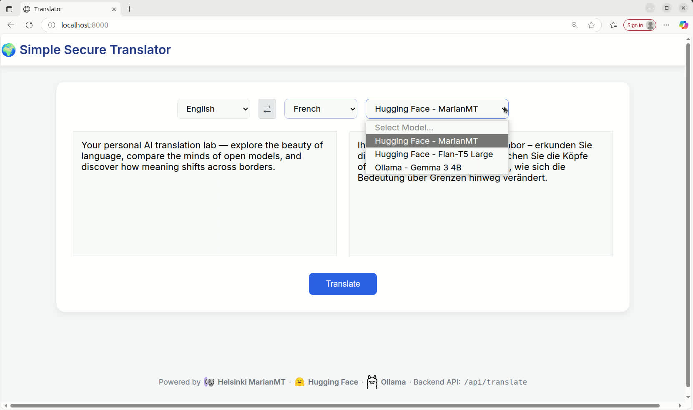

# 🧠 Translate locally. Keep your data private.



This web app runs completely on your own computer using open-source machine translation models. Nothing is sent to the cloud and no text ever leaves your machine. You get fast translation while staying in full control of your information. 

You choose the model that fits your hardware and needs. The app supports:

- Translation models from the Helsinki NLP team (Marian MT) via Hugging Face interface
- Large general-purpose models such as Flan-T5 from Google Research
- Powerful local models like Gemma 3 (4-billion parameters) from Google DeepMind available via Ollama

Everything runs locally. No accounts. No API keys. No external services required once installed.

## 💡 About this project

I created this app because I wanted a simple translation tool that respects privacy. No ads. No tracking. Just fast translations that stay on your own computer. It began as a hands-on follow-up to the Coursera course **MLOps: Machine Learing Operatios** by _Alfredo Deza_ and _Noah Gift_. After finishing the course, I wanted to see if I could build something on my own: a small, working application that blends modern MLOps ideas with practical NLP.
With the help of **Real Python** tutorials and the outstanding open translation models from the **Helsinki Language Technology Research Group (Helsinki-NLP)**, this idea slowly took shape.

I hope it provides a useful, distraction-free option for others as well.

## 🚀 Features

- 🌍 Multilingual translation with Helsinki-NLP's MarianMT models
- ⚙️ FastAPI backend with REST API endpoints
- 💻 Clean, responsive web interface (`index.html`)
- 🧠 Config-driven design (`config.json`)
- 🧪 Unit and integration testing via pytest
- 🧩 Modern development workflow using pyproject.toml and Makefile
- ✨ Auto-formatting and linting with Black, Ruff, and Prettier

## 🗂️ Project structure

```bash
.
├── config.json           # Model/language configuration
├── index.html            # Web front-end
├── Makefile              # Build, install, and test automation
├── pyproject.toml        # Project metadata & dependencies
├── requirements.txt      # Auto-generated pinned dependencies
├── src/
│ └── app.py # FastAPI application
└── tests/
├── test_unit.py
└── test_integration.py</pre>
```

## 🧰 Requirements

- **_Python 3.10 – 3.12_** (recommended 3.11)
- Linux / macOS environment
- make, pip, and venv available in PATH
- (optional: pyenv for version management)
- (optional) nodejs + npm for HTML/CSS linting

## ⚙️ Installation

Clone the repository and build everything with one command:

`make install`

This will:

1. Check your Python version
2. Create a virtual environment (`hf_translator/`)
3. Install pip-tools
4. Compile `requirements.txt` automatically from `pyproject.toml`
5. Install dependencies
6. Register your package in editable mode (pip install -e .)

If it’s your first run, the dependency compilation step (pip-compile) may take a few minutes — it’s resolving all transitive dependencies for deterministic builds.

## 💻 Running the app

Start the FastAPI server locally:

`make run`

or manually

`hf_translator/bin/uvicorn src.app:app --reload`

The open your browser at:

👉 [http://127.0.0.1:8000](http://127.0.0.1:8000)

You’ll see the web interface with two text boxes — enter text in one language, choose target language, and view the translation instantly.

## 🧪 Testing

Run all tests with:

`make test`

This executes both unit and integration tests located in the `tests/` folder.

You can also run pytest directly:

`hf_translator/bin/pytest -vv`

Warnings from third-party libraries (e.g. SWIG, PyTorch, SentencePiece) are filtered automatically via `pyproject.toml`.

## 🧩 Configuration

The app reads from config.json, which defines supported language pairs and their corresponding Hugging Face models:

```json
{
  "supported": {
    "de-en": "Helsinki-NLP/opus-mt-de-en",
    "en-de": "Helsinki-NLP/opus-mt-en-de",
    "fr-de": "Helsinki-NLP/opus-mt-fr-de",
    "de-fr": "Helsinki-NLP/opus-mt-de-fr",
    "en-fr": "Helsinki-NLP/opus-mt-en-fr",
    "fr-en": "Helsinki-NLP/opus-mt-fr-en"
  }
}
```

To extend it, simply add new pairs and model names — no code change required.

## 🧠 Development workflow

### Type checking and linting

Run all static checks (Python + HTML):

`make check`

### Format code

Automatically format Python and HTML:

`make format`

(Uses `black`+ `ruff` for Python and `prettier` for HTML.)

### Recompile dependencies

When you change pyproject.toml, regenerate pinned dependencies:

`make compile-deps`

### Clean build artifacts

`make clean`

### Full reset

`make clean-all`

## 🧪 API endpoints

| Method | Endpoint         | Description                                                                                 |
| ------ | ---------------- | ------------------------------------------------------------------------------------------- |
| `GET`  | `/`              | Serve web interface                                                                         |
| `POST` | `/api/translate` | Translate JSON payload `{ "text": "Hallo Welt", "source_lang": "de", "target_lang": "en" }` |

Example `curl` request:

## 🧠 Notes on dependencies

- `sentencepiece` → Required by MarianMT for subword tokenization
- `sacremoses` → Optional but recommended for language-specific preprocessing
- `torch` → Backend for Transformer inference
- `fastapi` + `uvicorn` → Web serving layer

All dependencies are declared in `pyproject.toml` and locked automatically by `pip-tools`.

## 🧩 Makefile overview

| Target              | Description                                         |
| ------------------- | --------------------------------------------------- |
| `make install`      | Setup venv, compile deps, install package           |
| `make compile-deps` | Regenerate `requirements.txt` from `pyproject.toml` |
| `make test`         | Run full test suite                                 |
| `make run`          | Start FastAPI server                                |
| `make format`       | Auto-format code (Python + HTML)                    |
| `make clean`        | Remove build/test caches                            |
| `make clean-all`    | Remove venv and lockfiles                           |

## 🧠 Tips

- Only recompile dependencies when you change `pyproject.toml? — it’s a heavy operation.
- To add new models or languages, just update config.json.

## 📄 License

MIT License © 2025 Martin Diergardt

## 🙌 Acknowledgements

- [Helsinki-NLP](https://huggingface.co/Helsinki-NLP) — developers of the [OPUS-MT](https://opus.nlpl.eu/opus-mt/) models, built on the **MarianMT encoder–decoder Transformer architecture** and trained on the large open **OPUS** multilingual corpus. Their work provides high-quality, open translation models covering hundreds of language pairs.  
  (Tiedemann & Thottingal, _OPUS-MT — Building Open Translation Services for the World_, EAMT 2020) [https://huggingface.co/Helsinki-NLP](https://huggingface.co/Helsinki-NLP)
- [Real Python](https://realpython.com/) — for clear guidance on modern Python project structure and packaging.
